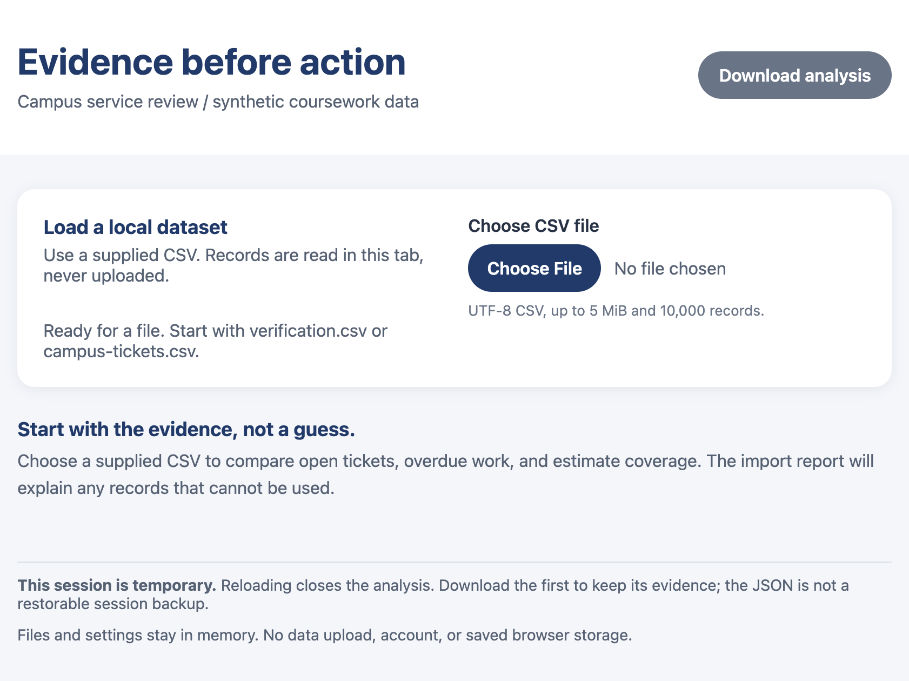

# Evidence Before Action

A local-first campus service review app for exploring synthetic coursework ticket data. CSV files are parsed and analyzed in the browser; they are not uploaded or saved in browser storage.



**Name:** Caitlin Ash

**ID:** 2231360

**Commit SHA or Tag:** `hw3-submission`

**Platform/OS Version:** Apple M2 Pro

## Technology

- React 19 and TypeScript 6 for the client-side application
- Vite 8 for development and production builds
- Papa Parse for CSV parsing
- Vitest for automated tests
- ESLint for linting

## Requirements

- Node.js 24.x
- npm

## Setup and run

**Install the dependencies using npm:**

```sh
npm install
```

**Start the local Vite development server:**

```sh
npm run dev
```

Open the local URL printed by Vite. Choose one of the sample datasets in `data/`, or a CSV with the required ticket headers.

## Tests

**Run the three automated Vitest acceptance cases:**

```sh
npm test
```

**The suite is in [`test/acceptance.test.ts`](test/acceptance.test.ts) and uses these small CSV fixtures:**

### A1 — `verification.csv`

**Fixture:** [`data/verification.csv`](data/verification.csv) (8 records). Checks that parsed field values are normalized strings, blank estimates remain unknown while `0` remains a known estimate, and independently expected metrics match:

| Filter | Matching | Open | Overdue open | Known open hours | Known open | Unknown open |
| --- | ---: | ---: | ---: | ---: | ---: | ---: |
| All records | 8 | 6 | 3 | 14 | 4 | 2 |
| North, open | 2 | 2 | 1 | 4 | 1 | 1 |

### A2 — `edge-cases.csv`

**Fixture:** [`data/edge-cases.csv`](data/edge-cases.csv) (24 records, including blank records). Checks accepted/rejected/ignored counts (`5` / `17` / `2`), first-valid duplicate-ID handling, quoted commas and newlines, and literal summary text such as `<b>Inspect me</b>` and `=1+1`.

### Combined filters and sorting

Uses the same eight-row `verification.csv` fixture as A1. It combines an ID search with North/open filters, sorts newest-first, and checks matching IDs (`T-00002`, `T-00001`), metrics, unchanged source-row order, filter/sort metadata, zone summaries, and exported matching rows.